# BÁO CÁO PHÂN TÍCH MÃ ĐỘC EXPLORER.EXE

> Mẫu mã độc EXPLORER.EXE và mật khẩu giải nén: infected.

## A. Tổng quan chung về mẫu mã độc

- Phân tích tĩnh mẫu mã độc thu được thông tin như sau:

  - Mẫu mã độc là PE file 32-bit được chỉnh sửa lần cuối vào khoảng thời gian `Friday 26 August 2016, 00.53.10` (Đây có thể là khoảng thời gian mã độc được tạo ra).
  - Hash MD5 của mã độc: `DABDCA8DB4420E0B0121B48130D2F4A6`.
  - Phần Resource của mã độc có lưu trữ các thành phần lạ như `DLL` hay `file PE 32-bit .NET`.

  

  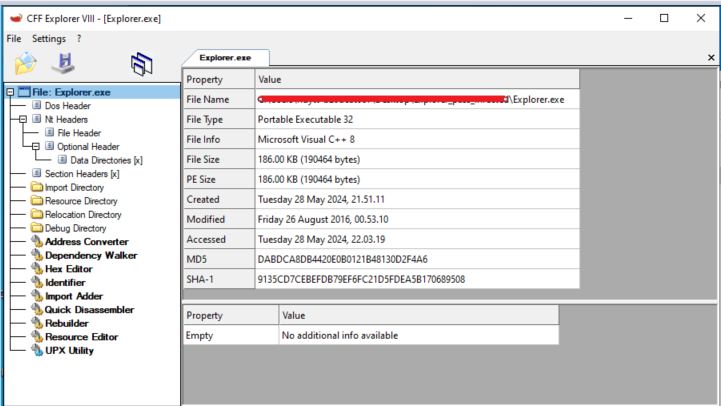

- Qua phân tích động phát hiện mã độc thực hiện các hành vi sau:

  - Ẩn dấu mã độc.
  - Thu thập thông tin máy tính người dùng.
  - Gửi các thông tin thu thập được đến C2C.
  - Thực hiện duy trì hoạt động ngay cả khi hệ thống khởi động lại.

  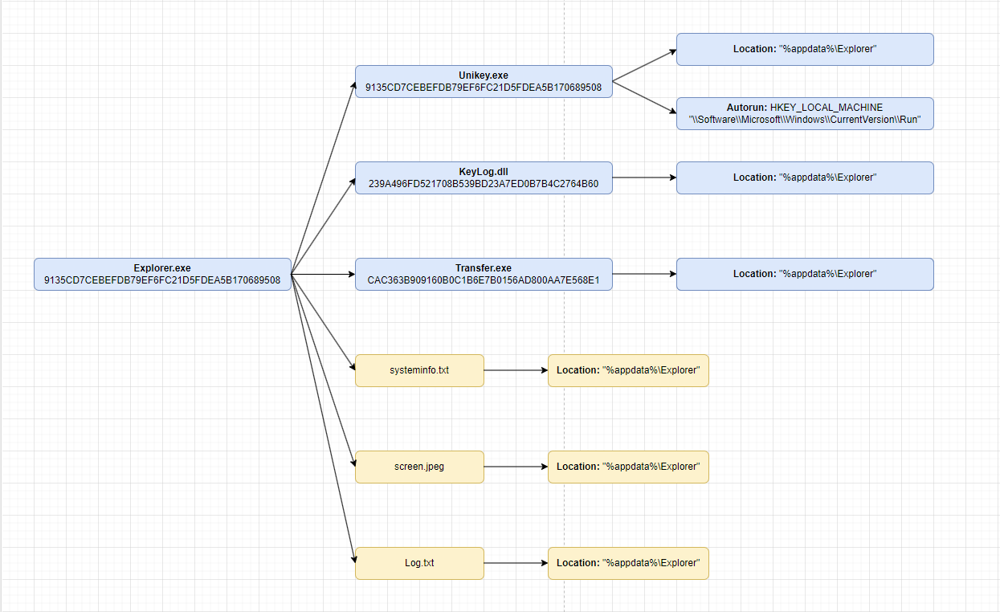

## B. Phân tích hành vi chi tiết của mẫu mã độc

- Tổng quan hàm `wmain()` của mã độc.

  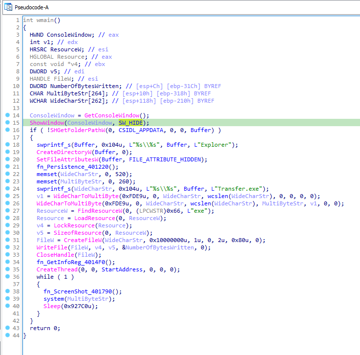

### [0]. Ẩn dấu mã độc

- Khi nạn nhân chạy mã độc, chương trình thực hiện hành vi ẩn dấu cửa sổ thực thi `(màn hình console)` bằng hàm windowsAPI `ShowWindow` với tham số `SW_HIDE`.

  

- Sau đó mã độc tạo một thư mục có đường dẫn là `"%appdata%\Explorer"` với thuộc tính ẩn để lưu trữ các file mã độc được sinh ra từ file gốc `Explorer.exe` cũng như các thông tin thu thập được sau này.

  

- Truy cập đường dẫn thư mục `"%appdata%\Explorer"` sau khi thực thi mã độc.

  

### [1]. Thực hiện hành vi duy trì hoạt động

- Hàm `wmain()` thực hiện gọi hàm `fn_Persistence_401220();` để thực hiện hành vi duy trì hoạt động của mã độc ngay cả khi hệ thống khởi động lại.

  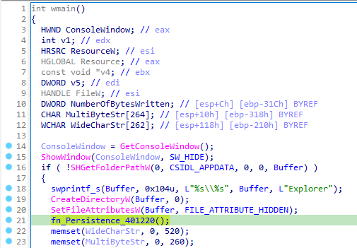

- Để có thể thực hiện hành vi duy trì hoạt động của mã độc trên máy tính nạn nhân, mã độc đăng ký một khóa trong Registry `HKEY_LOCAL_MACHINE`. Các bước thực hiện hành vi này của mã độc bao gồm:

  - Mã độc tự copy chính mình thành một file bản sao với tên gọi `Unikey.exe` ở trong thư mục `"%appdata%\Explorer"`.
  - Đăng ký một khóa registry trong `\Software\Microsoft\Windows\CurrentVersion\Run` với tên gọi là `Unikey NT` và giá trị là đường dẫn file `"%appdata%\Explorer\Unikey.exe"` vừa được tạo.

  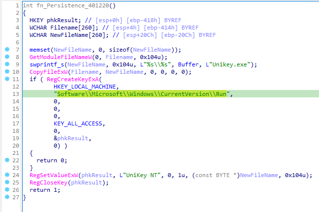

### [2]. Thu thập thông tin nạn nhân

- Hàm `wmain()` thực hiện gọi hàm `fn_GetInfoReg_4014F0();` để thực hiện hành vi thu thập các thông tin về máy nạn nhân bao gồm thông tin về bộ vi xử lý, các ứng dụng đã cài đặt.

  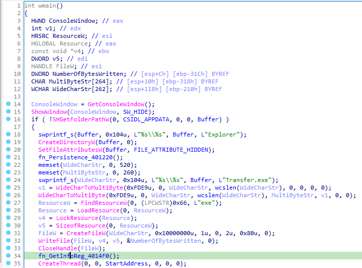

- Hàm này truy xuất thông tin từ Registry `HKEY_LOCAL_MACHINE` của máy tính nạn nhân và lưu tại `%appdata%\Explorer\systeminfor.txt`.

  - Thông tin bộ vi xử lý được mã độc truy xuất từ `"HARDWARE\\DESCRIPTION\\System\\CentralProcessor\\0"` với giá trị là `ProcessorNameString`.
    
  - Thông tin các ứng dụng đã cài đặt được mã độc truy xuất từ `"SOFTWARE\\Microsoft\\Windows\\CurrentVersion\\Uninstall"` với các trường giá trị `DisplayName`, `DisplayVersion` và `InstallLocation`.
    

- Ngoài ra cuối hàm `wmain()`, mã độc còn thực thi hành vi của keylogger nhằm lấy log từ bàn phím và ảnh chụp màn hình.

  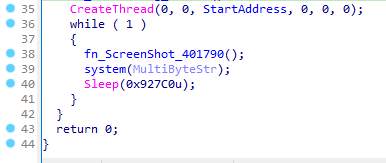

- Nhằm thực hiện hành vi lấy log từ bàn phím, mã độc thực thi một thread mới. Trong thread này nó sử dụng các hàm windowsAPI `FindResourceW`, `LoadResource` và `LockResource` để lấy dữ liệu từ phần resource của file gốc - `Explorer.exe` rồi trích xuất dữ liệu đó vào file `KeyLog.dll`. Sau đó mã độc sử dụng các hàm windowsAPI `LoadLibrary` và `GetProcAddress` để thực thi các function trong file dll vừa tạo.

  

  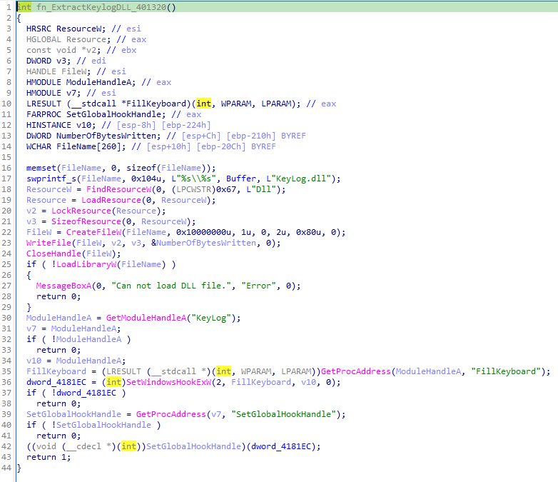

- Phân tích file `KeyLog.dll` là thư viện chứa các hàm dùng để ghi dữ liệu bàn phím thu thập được ra file `"%appdata%\Explorer\Log.txt"` và gọi hook. Kỹ thuật mà mã độc sử dụng là `UserHook Hook WH_Keyboard`.

  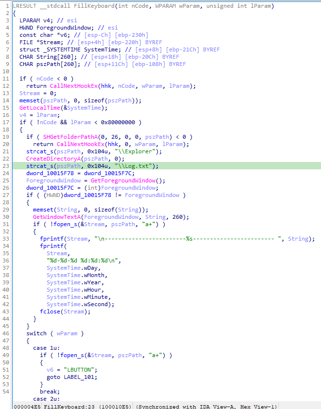

- Về phần lấy log hình ảnh, mã độc thực hiện chụp ảnh màn hình và ghi ra file `screen.jpeg` trong thư mục `%appdata%\Explorer`.

  

### [3]. Tương tác với máy chủ C2C

- Mã độc thực hiện việc tương tác thông tin với C2C thông qua file `Transfer.exe` được tạo ra bằng cách sử dụng các windowsAPI `FindResourceW`, `LoadResource` và `LockResource` để lấy dữ liệu từ phần resource của file gốc - `Explorer.exe`, sau đó thực thi file này thông qua hàm `system`.

  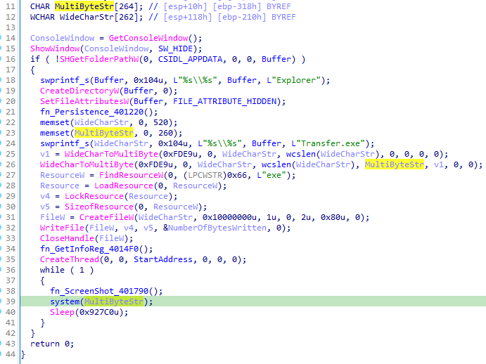

- Phân tích file `Transfer.exe` bằng `dnSpy` thu được thông tin và phương thức gửi dữ liệu. Mã độc lấy các file `Log.txt`, `screen.jpeg`, `systeminfo.txt` sau đó thực hiện gửi đến C2C bằng phương thức mail smtp. Tài khoản gửi là `anhthc95@gmail.com` với mật khẩu `123456789@A` và địa chỉ người nhận là `hunganh1803@gmail.com`. Quá trình này lặp đi lặp lại và khoảng thời gian giữa hai lần gửi là 60000ms.

  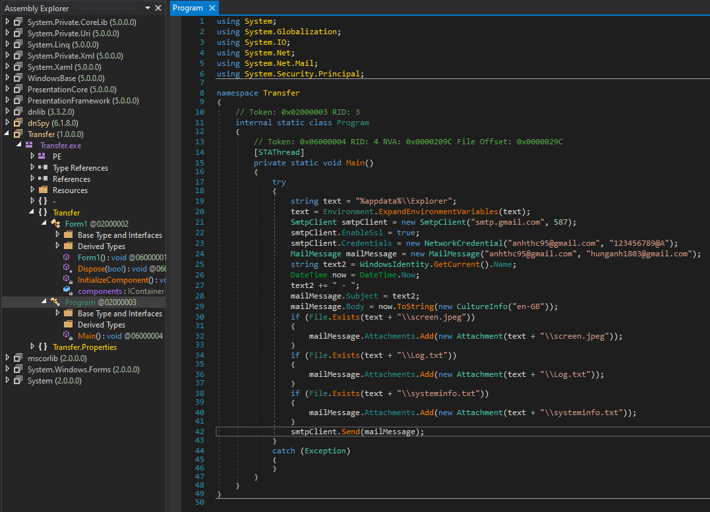

## C. IOC và khuyến cáo

- Thông tin của mã độc:

| Filename     | SHA1                                     |
| ------------ | ---------------------------------------- |
| Explorer.exe | 9135CD7CEBEFDB79EF6FC21D5FDEA5B170689508 |
| Unikey.exe   | 9135CD7CEBEFDB79EF6FC21D5FDEA5B170689508 |
| KeyLog.dll   | 239A496FD521708B539BD23A7ED0B7B4C2764B60 |
| Transfer.exe | CAC363B909160B0C1B6E7B0156AD800AA7E568E1 |

- Thông tin phương thức tương tác và máy chủ C2C:

| C2C Protocol | Email                 |
| ------------ | --------------------- |
| SMTP mail    | anhthc95@gmail.com    |
| SMTP mail    | hunganh1803@gmail.com |

- MITRE ATT&CK Tatics and Techniques Mapping:

| Tactic              | Techniques                                                                     |
| ------------------- | ------------------------------------------------------------------------------ |
| Execution           | T1129: Shared Modules                                                          |
| Persistence         | T1547.001: Boot or Logon Autostart Execution: Registry Run Keys/Startup Folder |
| Defense Evasion     | T1564.004: Hide Artifacts: NTFS File Attributes                                |
| Cridential Access   | T1056.001: Input Capture: Keylogging                                           |
| Discovery           | T1012: Query Registry                                                          |
| Collection          | T1113: Screen Capture                                                          |
| Command and Control | T1071.003: Application Layer Protocol: Mail Protocols                          |
